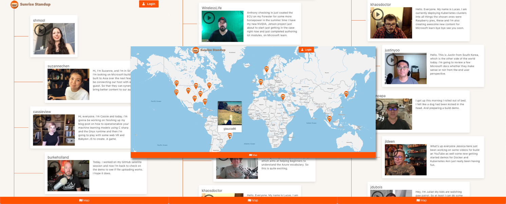
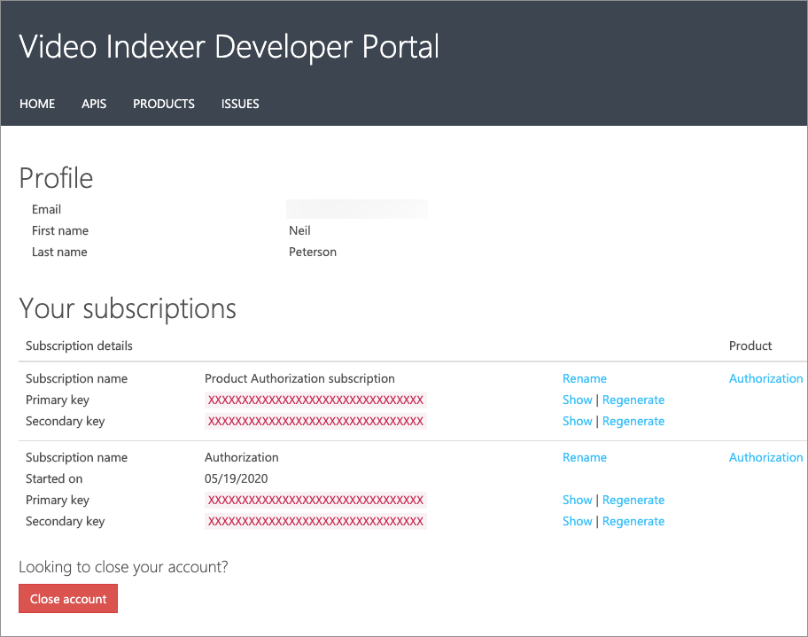
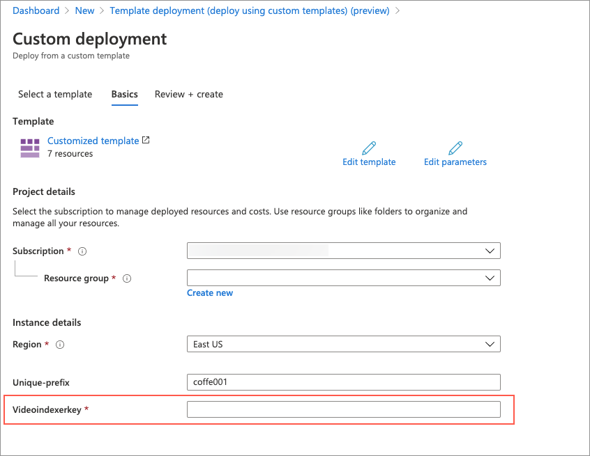
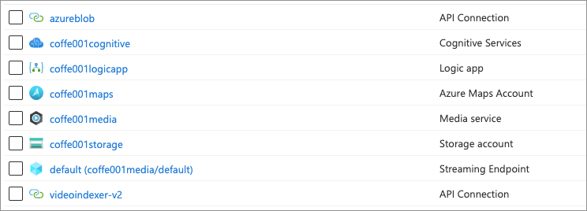
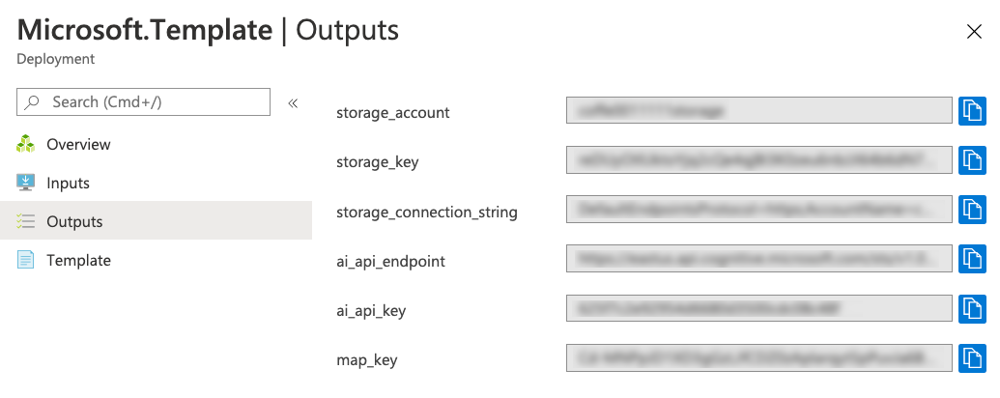

# Sunrise Standup

Sunrise Standup is a status update application built as a demo for Build 2020. It allows users to submit a 15 second status update video clip and displays those clips in order by date in a feed. The user's location is recorded and displayed on an interactive map.



This application levarages several Azure resources...

1. **Azure Storage** for video uploads
1. **Cognitive Services** for video transcription
1. **Azure Maps** for the interactive map control
1. **Video Indexer** to pull thumbnails off of videos
1. **Logic Apps** to create a thumbnail when a video is uploaded

## Setup Azure Resources

1. Create a Video Index account and go to your profile page. [here](https://api-portal.videoindexer.ai/), Make note of your primary key.

   

1. Get a [Github Personal API key](https://github.com/settings/tokens) and make note of it. You'll need **read:user** permissions.

1. Click the button below which will setup all of the required resources in Azure. You'll need to provide the video indexer key from step 1. Make sure you change the value of "unique-prefix" to something unique.

   [](https://portal.azure.com/#create/Microsoft.Template/uri/https%3A%2F%2Fraw.githubusercontent.com%2Fsunrise-standup%2Fsunrise-standup%2Fmaster%2Fazuredeploy.json)

   

1. Once finished, the following resources will be deployed...

   

1. Go to the Resource Group and under "Settings", select "Deployments". Select the "Microsoft.Template" item and then select "Outputs" to display the keys needed for the Sunrise Standup. You'll be using these keys when you setup the application.

   

## Setup application

1. Clone (or Fork and Clone) this repository

1. Rename the "api/local.settings.json.rename" to "api/local.settings.json".

The "local.settings.json" file holds all of the keys that the application needs. You'll need to copy these keys in from the corresponding template output in the portal.

| local.settings.json setting | Template output           |
| --------------------------- | ------------------------- |
| STORAGE_ACCOUNT             | storage_account           |
| STORAGE_KEY                 | storage_key               |
| STORAGE_CONNECTION_STRING   | storage_connection_string |
| MAP_KEY                     | map_key                   |
| AI_API_KEY                  | ai_api_key                |
| GITHUB_API_KEY              | Github API key            |

## Running the application locally

This project can be run anywhere, but VS Code is required for local debugging.

1. Open the application with VS Code.

### Running the frontend

1. Install frontend dependencies...

   ```bash
   npm install
   ```

1. Run the frontend project in the browser (automatically opens a browser window).

   ```bash
   npm start
   ```

### Running the API

1. From VS Code, press <kbd>F5</kbd>

## Deploying the App to Static Web Apps

1. Create a [new Static Web App](https://portal.azure.com/#create/Microsoft.StaticApp).

1. Select the Github repo for this project from the Azure Web Apps create screen.

For more information on Static Web Apps, check out the [Static Web Apps documentation](https://aka.ms/swadocs).
